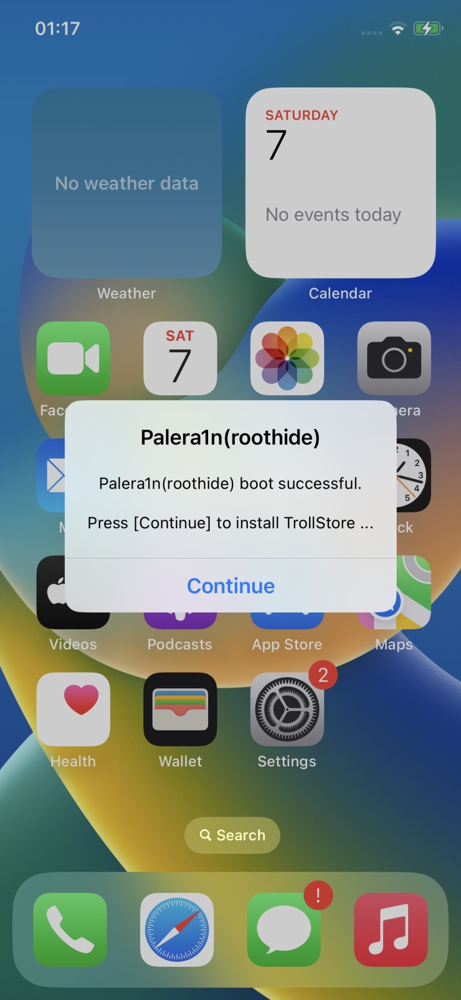

# roothide palera1n

- Document: https://github.com/roothide/Developer

- Support: https://twitter.com/roothideDev

- Discord: https://discord.gg/ZvY2Yjw8GA

# How To Use

- Step 1:

for Windows PC Users, make a usb flash driver with [`palen1x-*.iso`](https://github.com/roothide/palera1n-roothide/releases) and use it to boot your device with palera1n(roothide).

for MacOS/Linux Users, unzip [`palehide.zip`](https://github.com/roothide/palera1n-roothide/releases) and directly open/run `palehide.sh` to boot your device with palera1n(roothide).

- Step 2:

after device boot successful, a message should show up on Home Screen, and palera1n(roothide) will auto install TrollStore on your device. 
then you can be able to install:

1): [roothide Dopamine2](https://github.com/roothide/Dopamine2-roothide) (iOS 15/16)

2): [roothide Bootstrap 2.0](https://github.com/roothide/Bootstrap) (iPadOS 17/18) (not released yet)

# Source Code

- palera1n cli: https://github.com/palera1n/palera1n

- pongo/kpf: https://github.com/roothide/PongoOS

- jbinit: https://github.com/roothide/palehide-jbinit

- palen1x: https://github.com/roothide/palen1x
